* goal
  * how to choose the Angular forms approach
  * MAIN building block / Angular forms approach
  * Angular forms approach comparison about
    * setup,
    * data flow,
    * testing

* Forms
  * 💡MAIN goal of MANY applications == handle user inputs 💡
  * use cases
    * enable user to
      * log in,
      * update a profile,
      * enter sensitive information
      * ...
  * allows
    * capturing user input events from the view
    * validating user input
    * updating and track the changes -- via a --
      * form model
      * data model

* Angular forms approaches
  * reactive
  * template-driven

## Choosing an approach

| Forms                 | Details                                                                                                                                                                                                                                                                                                                          |
|:---                   |:---------------------------------------------------------------------------------------------------------------------------------------------------------------------------------------------------------------------------------------------------------------------------------------------------------------------------------|
| Reactive forms        | provide -- direct, explicit access to the -- underlying form's object model   vs template-driven forms, MORE robust (scalable, reusable, and testable)   👀use cases 👀   &nbsp; forms are KEY part of your application   &nbsp; you're ALREADY using reactive patterns in your application                      |
| Template-driven forms | if you want to to create and manipulate the underlying object model -> rely on directives in the template    👀use cases 👀   &nbsp; adding a SIMPLE form to an app (_Example:_ email list signup form)   &nbsp; requirements and logic / can be managed solely in the template   vs reactive forms, scale worst |

### Key differences

|                                                    | Reactive                             | Template-driven                 |
|:---                                                |:---                                  |:---                             |
| [Setup of form model](#setting-up-the-form-model)  | Explicit, created in component class | Implicit, created by directives |
| [Data model](#mutability-of-the-data-model)        | Structured and immutable             | Unstructured and mutable        |
| [Data flow](#data-flow-in-forms)                     | Synchronous                          | Asynchronous                    |
| [Form validation](#form-validation)                | Functions                            | Directives                      |

### Scalability

* == reuse form models | components 
* use cases
  * forms == central part of your application
* recommendations
  * if scalability is crucial for you -> use reactive forms
    * Reason: 🧠
      * reactive forms 
        * -- provide direct access to the -- underlying form API
        * view data -- exchanges ,via [synchronous data flow](#data-flow-in-reactive-forms), information with the -- data model
        * less setup for testing / less understanding of change detection

## Setting up the form model

* BOTH approaches
  * track value changes between 
    * form input elements / users interact with -- & -- your component model's form data
  * SAME underlying building blocks
  * ⚠️DIFFERENT way about form-control instances, to ⚠️
    * create
    * manage 

### COMMON (== | BOTH form approaches) form foundation classes

| Base classes           | Details                                                                                  |
|:---                    |:-----------------------------------------------------------------------------------------|
| `FormControl`          | Tracks the individual form control's   &nbsp; value   &nbsp; validation status   |
| `FormGroup`            | Tracks the collection of form controls'   &nbsp; SAME values   &nbsp; SAME status |
| `FormArray`            | Tracks the array of form controls'   &nbsp; SAME values   &nbsp; SAME status     |
| `ControlValueAccessor` | Creates a bridge between Angular `FormControl` instances -- & -- built-in DOM elements   |

### Setup | reactive forms

* | reactive forms,
  * the form model 
    * -- is defined directly, 👀via [SOME base class](#common---both-form-approaches-form-foundation-classes)👀, -- | component class
    * -- provides, 👀via [SOME base class](#common---both-form-approaches-form-foundation-classes)👀, the -- form's value and status | ANY given point in time

* `[formControl]` directive
  * `FormControl` instance -- is linked, via an internal value accessor, to a -- specific form element | view  

* _Example:_ [source code](/adev/src/content/examples/forms-overview/final)

### Setup | template-driven forms

* | template-driven forms,
  * the form model is implicit
  * `NgModel` -- creates and manages, 👀for you 👀, a -- `FormControl` instance / GIVEN form element

* _Example:_ [source code](/adev/src/content/examples/forms-overview/final)

## Data flow in forms

* TODO:
When an application contains a form, Angular must keep the view in sync with the component model and the component model in sync with the view.
As users change values and make selections through the view, the new values must be reflected in the data model.
Similarly, when the program logic changes values in the data model, those values must be reflected in the view.

Reactive and template-driven forms differ in how they handle data flowing from the user or from programmatic changes.
The following diagrams illustrate both kinds of data flow for each type of form, using the favorite-color input field defined above.

### Data flow in reactive forms

In reactive forms each form element in the view is directly linked to the form model (a `FormControl` instance).
Updates from the view to the model and from the model to the view are synchronous and do not depend on how the UI is rendered.

The view-to-model diagram shows how data flows when an input field's value is changed from the view through the following steps.

1. The user types a value into the input element, in this case the favorite color *Blue*.
1. The form input element emits an "input" event with the latest value.
1. The `ControlValueAccessor` listening for events on the form input element immediately relays the new value to the `FormControl` instance.
1. The `FormControl` instance emits the new value through the `valueChanges` observable.
1. Any subscribers to the `valueChanges` observable receive the new value.

```mermaid
flowchart TB
    U{User}
    I("<input>")
    CVA(ControlValueAccessor)
    FC(FormControl)
    O(Observers)
    U-->|Types in the input box|I
    I-->|Fires the 'input' event|CVA
    CVA-->|"Calls setValue() on the FormControl"|FC
    FC-.->|Fires a 'valueChanges' event to observers|O
```

The model-to-view diagram shows how a programmatic change to the model is propagated to the view through the following steps.

1. The user calls the `favoriteColorControl.setValue()` method, which updates the `FormControl` value.
1. The `FormControl` instance emits the new value through the `valueChanges` observable.
1. Any subscribers to the `valueChanges` observable receive the new value.
1. The control value accessor on the form input element updates the element with the new value.

```mermaid
flowchart TB
    U{User}
    I(<input>)
    CVA(ControlValueAccessor)
    FC(FormControl)
    O(Observers)
    U-->|"Calls setValue() on the FormControl"|FC
    FC-->|Notifies the ControlValueAccessor|CVA
    FC-.->|Fires a 'valueChanges' event to observers|O
    CVA-->|"Updates the value of the <input>"|I
```

### Data flow in template-driven forms

In template-driven forms, each form element is linked to a directive that manages the form model internally.

The view-to-model diagram shows how data flows when an input field's value is changed from the view through the following steps.

1. The user types *Blue* into the input element.
1. The input element emits an "input" event with the value *Blue*.
1. The control value accessor attached to the input triggers the `setValue()` method on the `FormControl` instance.
1. The `FormControl` instance emits the new value through the `valueChanges` observable.
1. Any subscribers to the `valueChanges` observable receive the new value.
1. The control value accessor also calls the `NgModel.viewToModelUpdate()` method which emits an `ngModelChange` event.
1. Because the component template uses two-way data binding for the `favoriteColor` property, the `favoriteColor` property in the component is updated to the value emitted by the `ngModelChange` event \(*Blue*\).

```mermaid
flowchart TB
    U{User}
    I(<input>)
    CVA(ControlValueAccessor)
    FC(FormControl)
    M(NgModel)
    O(Observers)
    C(Component)
    P(Two-way binding)
    U-->|Types in the input box|I
    I-->|Fires the 'input' event|CVA
    CVA-->|"Calls setValue() on the FormControl"|FC
    FC-.->|Fires a 'valueChanges' event to observers|O
    CVA-->|"Calls viewToModelUpdate()"|M
    M-->|Emits an ngModelChange event|C
    C-->|Updates the value of the two-way bound property|P
```

The model-to-view diagram shows how data flows from model to view when the `favoriteColor` changes from *Blue* to *Red*, through the following steps

1. The `favoriteColor` value is updated in the component.
1. Change detection begins.
1. During change detection, the `ngOnChanges` lifecycle hook is called on the `NgModel` directive instance because the value of one of its inputs has changed.
1. The `ngOnChanges()` method queues an async task to set the value for the internal `FormControl` instance.
1. Change detection completes.
1. On the next tick, the task to set the `FormControl` instance value is executed.
1. The `FormControl` instance emits the latest value through the `valueChanges` observable.
1. Any subscribers to the `valueChanges` observable receive the new value.
1. The control value accessor updates the form input element in the view with the latest `favoriteColor` value.

```mermaid
flowchart TB
    C(Component)
    P(Property bound to NgModel)
    C-->|Updates the property value|P
    P-->|Triggers CD|CD1


    subgraph CD1 [First Change Detection]
        direction TB
        M(NgModel)
        FC(FormControl)

        M-->|Asynchronously sets FormControl value|FC
    end
    CD1-->|Async actions trigger a second round of Change Detection|CD2

    subgraph CD2 [Second Change Detection]
        direction TB
        FC2(FormControl)
        O(Observers)
        CVA(ControlValueAccessor)
        I("<input>")
        FC2-.->|Fires a 'valueChanges' event to observers|O
        O-->|ControlValueAccessor receives valueChanges event|CVA
        CVA-->|Sets the value in the control|I
    end
```

Note: `NgModel` triggers a second change detection to avoid `ExpressionChangedAfterItHasBeenChecked` errors, because the value change originates in an input binding.

### Mutability of the data model

The change-tracking method plays a role in the efficiency of your application.

| Forms                 | Details |
|:---                   |:---     |
| Reactive forms        | Keep the data model pure by providing it as an immutable data structure. Each time a change is triggered on the data model, the `FormControl` instance returns a new data model rather than updating the existing data model. This gives you the ability to track unique changes to the data model through the control's observable. Change detection is more efficient because it only needs to update on unique changes. Because data updates follow reactive patterns, you can integrate with observable operators to transform data. |
| Template-driven forms | Rely on mutability with two-way data binding to update the data model in the component as changes are made in the template. Because there are no unique changes to track on the data model when using two-way data binding, change detection is less efficient at determining when updates are required.                                                                                                                                                                                                                                 |

The difference is demonstrated in the previous examples that use the favorite-color input element.

* With reactive forms, the **`FormControl` instance** always returns a new value when the control's value is updated
* With template-driven forms, the **favorite color property** is always modified to its new value

## Form validation

Validation is an integral part of managing any set of forms.
Whether you're checking for required fields or querying an external API for an existing username, Angular provides a set of built-in validators as well as the ability to create custom validators.

| Forms                 | Details |
|:---                   |:---     |
| Reactive forms        | Define custom validators as **functions** that receive a control to validate                                 |
| Template-driven forms | Tied to template **directives**, and must provide custom validator directives that wrap validation functions |

For more information, see [Form Validation](guide/forms/form-validation#validating-input-in-reactive-forms).

## Testing

Testing plays a large part in complex applications.
A simpler testing strategy is useful when validating that your forms function correctly.
Reactive forms and template-driven forms have different levels of reliance on rendering the UI to perform assertions based on form control and form field changes.
The following examples demonstrate the process of testing forms with reactive and template-driven forms.

### Testing reactive forms

Reactive forms provide a relatively straightforward testing strategy because they provide synchronous access to the form and data models, and they can be tested without rendering the UI.
In these tests, status and data are queried and manipulated through the control without interacting with the change detection cycle.

The following tests use the favorite-color components from previous examples to verify the view-to-model and model-to-view data flows for a reactive form.

<!--todo: make consistent with other topics -->

#### Verifying view-to-model data flow

The first example performs the following steps to verify the view-to-model data flow.

1. Query the view for the form input element, and create a custom "input" event for the test.
1. Set the new value for the input to *Red*, and dispatch the "input" event on the form input element.
1. Assert that the component's `favoriteColorControl` value matches the value from the input.

<docs-code header="Favorite color test - view to model" path="adev/src/content/examples/forms-overview/src/app/reactive/favorite-color/favorite-color.component.spec.ts" visibleRegion="view-to-model"/>

The next example performs the following steps to verify the model-to-view data flow.

1. Use the `favoriteColorControl`, a `FormControl` instance, to set the new value.
1. Query the view for the form input element.
1. Assert that the new value set on the control matches the value in the input.

<docs-code header="Favorite color test - model to view" path="adev/src/content/examples/forms-overview/src/app/reactive/favorite-color/favorite-color.component.spec.ts" visibleRegion="model-to-view"/>

### Testing template-driven forms

Writing tests with template-driven forms requires a detailed knowledge of the change detection process and an understanding of how directives run on each cycle to ensure that elements are queried, tested, or changed at the correct time.

The following tests use the favorite color components mentioned earlier to verify the data flows from view to model and model to view for a template-driven form.

The following test verifies the data flow from view to model.

<docs-code header="Favorite color test - view to model" path="adev/src/content/examples/forms-overview/src/app/template/favorite-color/favorite-color.component.spec.ts" visibleRegion="view-to-model"/>

Here are the steps performed in the view to model test.

1. Query the view for the form input element, and create a custom "input" event for the test.
1. Set the new value for the input to *Red*, and dispatch the "input" event on the form input element.
1. Run change detection through the test fixture.
1. Assert that the component `favoriteColor` property value matches the value from the input.

The following test verifies the data flow from model to view.

<docs-code header="Favorite color test - model to view" path="adev/src/content/examples/forms-overview/src/app/template/favorite-color/favorite-color.component.spec.ts" visibleRegion="model-to-view"/>

Here are the steps performed in the model to view test.

1. Use the component instance to set the value of the `favoriteColor` property.
1. Run change detection through the test fixture.
1. Use the `tick()` method to simulate the passage of time within the `fakeAsync()` task.
1. Query the view for the form input element.
1. Assert that the input value matches the value of the `favoriteColor` property in the component instance.

## Next steps

To learn more about reactive forms, see the following guides:

<docs-pill-row>
  <docs-pill href="guide/forms/reactive-forms" title="Reactive forms"/>
  <docs-pill href="guide/forms/form-validation#validating-input-in-reactive-forms" title="Form validation"/>
  <docs-pill href="guide/forms/dynamic-forms" title="Dynamic forms"/>
</docs-pill-row>

To learn more about template-driven forms, see the following guides:

<docs-pill-row>
  <docs-pill href="guide/forms/template-driven-forms" title="Template Driven Forms tutorial" />
  <docs-pill href="guide/forms/form-validation#validating-input-in-template-driven-forms" title="Form validation" />
  <docs-pill href="api/forms/NgForm" title="NgForm directive API reference" />
</docs-pill-row>
